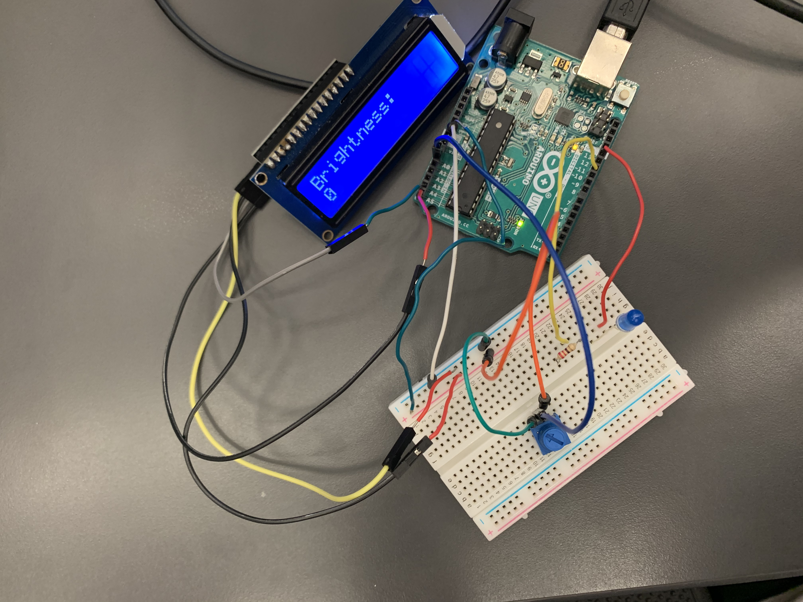

# Arduino
All my small projects

'

# **POTENTIOMETER**

# **Description:**

# **Reflection:**

# **MOTOR CONTROL**

# **Description:**
For this small project, my goal was to control the speed of a motor using a potentiometer. My final project showed that when I turned the  potentiometer towards the right, the motor spun faster. And when I spun the potentiometer to the left, the motor spun far slower.

 # **Wiring/Video**

[Motor Video](https://www.youtube.com/watch?v=CYTWTmqcXOA)

# **Code:**

[Code link](https://github.com/hcoyle91/Arduino/blob/master/Motor%20Control/Motor%20Control.ino)

# **Reflection**

Controlling the motor was challenging. The wiring tripped me up. I didn't understand the diode when I started to wire which led to me doing it wrong. After help from the teacher and some research the project was complete. 

# **SWEEPS AND LOFTS**

# **Description:**

For this project I had to create two parts in solidworks using the instructions in the tutorial guide called sweeps and lofts.. 

### **Hammer**

### **Candle Stick**

# **Reflection:**

These two parts were fairly easy to create due to the instructions helping every step of the way. I had trouble creating the handle on the candlestick. It was a new type of sketch. This was a helpful skill to learn.

# **PHOTOINTURUPTER**

# **Description:**
For this small project I programmed a led to Light up when anything opec passed through a photo interrupter. I order to use the photo interrupter better, I  used a function called blink.

# **Code:**

[Code for photointerpter](https://github.com/hcoyle91/Arduino/blob/master/photointerupter/photointerupter.ino)

# **Reflection:**
 At first I thought that I had accidentally saughterd the photo interrupter wrongly and shorted it out. I turns out my blink function was wrong. After that the project went well.
 

# **LED BLINK REVISITED**
 
# **Description:**
For this tiny project I made an LED blink. It helped me remember coding from last year.

# **Code:**

https://github.com/hcoyle91/Arduino/tree/master/Blink%20LED

# **Reflection:**
This project was challenging due to me being rusty. But after I remembered stuff from last year it went well.

# **LCD BACKPACK**

# **Description:**

In this assignment I learned how to use a backpack with an LCD screen. It makes it easier to use and communicate with the LCD screen.

# **Code:**

https://github.com/hcoyle91/Arduino/blob/master/LCD%20Backpack/LCD%20Backpack.ino

# **Reflection:**

This project made the LCD screen a lot easier for me. The backpack allowed me to use fewer wires. It went very smoothly.

# **LCD SCREEN**

# **Description:**

For this tiny project I printed "hello lcd" on an lcd screen.

# **Wiring:**

# **Code:**

https://github.com/hcoyle91/Arduino/blob/master/hello%20LCD/Hello%20LCD.ino

# **Reflection:**

This project was mildly challenging. I was new to how to code the LCD screen and all the wires were very confusing. Since there were 16 wires on the back of the lcd, it confused me. I had to redo my wiring several times to make sure those were correct. After I cleaned it up, the project worked well.

# **ALITTLE PRACTICE**

# **Description:**

# **Reflection:**
